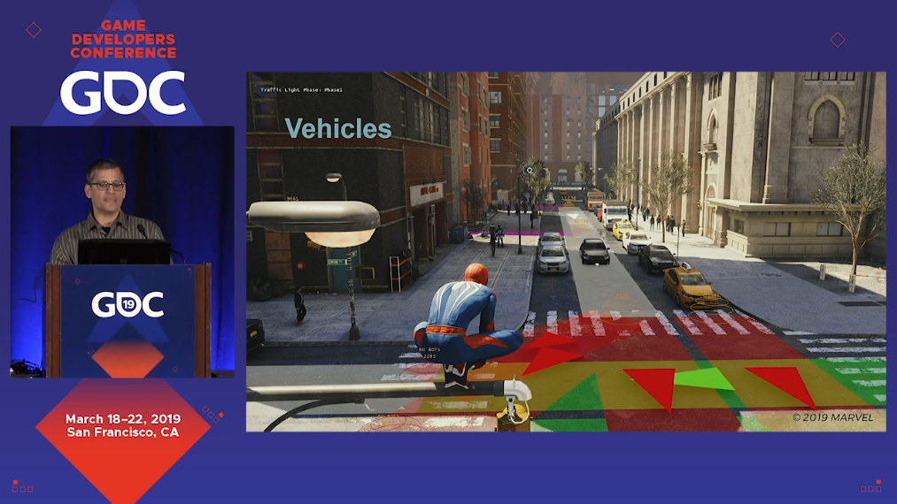
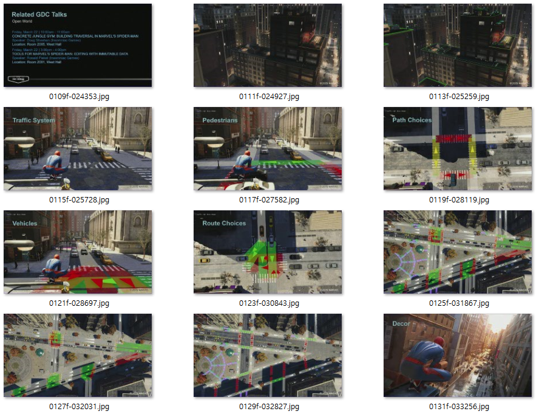

# GDC-Video-Splitter
This python scripts split gdc presentation format videos in a specified folder into seperate scenes.

## Arguments
python main.py [name of the folder which contains video files to split] {-o [name of the folder to store split scenes]}

## Algorithm

### Presentation Region Detection Phase
1. Scan video from the beginning to detect a presentation region.
2. If a presentation region is detected, clipping begins.

### Clipping Phase
1. The script tries to find the presentation region for every frame.
2. If the region is not found, the script considers it as full screen scene and captures following sequence as an mp4 file.
3. If the region is found, the script calculates the difference between frames.
4. If the difference is small, the script considers it as a static image. (clipped into a jpg file)
5. If the difference is large enough, the script consider it as transitioning or animating scene. (baked into a gif file)

## Dependencies
argparse <https://docs.python.org/3/library/argparse.html>

imageio <https://imageio.github.io/>

numpy <https://www.numpy.org/>

opencv2 <https://opencv.org/>

tqdm <https://tqdm.github.io/>

## Result

